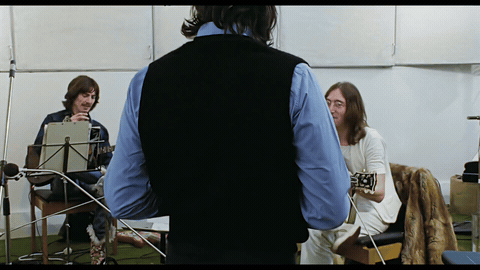

# Did you actually look? 👀

If you happen to be a recruiter poking around, you just have to say that the codeword is "Bagheera".

## Context

In *[Get Back](https://en.wikipedia.org/wiki/The_Beatles:_Get_Back)* episode 2, The Beatles are talking about their 1968 visit to Risikesh, and Paul mentions John's helicopter ride with the Maharishi.

  

> **Paul:** And Linda remembered that thing you said the other night, about when you went up in the helicopter with him. You just thought he might slip you The Answer.
>
> **John:** I thought he might fly home.
>
> **Paul:** Sort of, *Oh, tell me, O Master.*
>
> **Paul:** *Hey, hey, John. By the way, John...*
>
> **Paul:** *I've been meaning to tell you, son.*
> 
> **John:** *The word is "Bagheera."*

Inspired by [did-you-actually-check-my-github](https://github.com/Nikhil-Suresh/did-you-actually-check-my-github).
